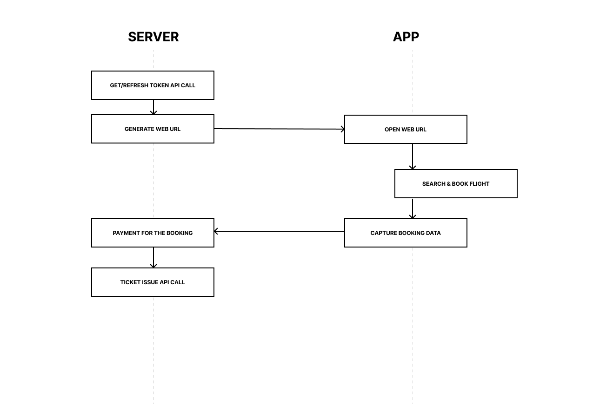

# Sasto Tickets Web-Based SDK for Mobile Apps

## Introduction

The Sasto Tickets Web-Based SDK enables seamless integration of flight booking and ticketing features into vendor applications. Designed for B2C use, the SDK simplifies the interaction by allowing vendors to manage payment and ticket issuance while we handle the core booking operations.

### Setting Up:
Vendors need to set up an business account with us. They will be provided with the **BASE_API_URL** and credentials for both UAT (User Acceptance Testing) and live environments by our Team.

### How It Works:

### Step 1: Get Token: 
Using the provided credentials, vendors must call our `get-token` API from their backend to obtain an access token. This token is essential for interacting with other SDK endpoints and must be passed during redirection as outlined in the documentation.

### Step 2: Flight Booking & Ticketing Workflow with our Solution

The Web SDK facilitates the flight search functionality. The SDK checks the availability of selected flights and provides detailed options for the vendor’s app.The SDK handles flight reservation, returning booking details to the vendor.

### Step 3: Payment (Vendor’s System)

The vendor’s app manages the payment process using the data provided by the SDK.

### Step 4: Issue Ticket

The vendor’s backend calls the `issue-ticket` API to confirm the booking and issue tickets.

> **Note:** Steps 2 is fully managed by our SDK, while other steps are handled by the vendor’s system.

---

## FAQ

### 1. **What is the Sasto Tickets B2C SDK?**
   - It is a web-based solution for integrating flight booking and ticketing features into vendor applications.
   - It simplifies the process by handling flight search, availability, and reservation workflows.

### 2. **Who manages the payment process?**
   - The vendor’s system is responsible for managing and securing the payment process. The SDK only facilitates the booking process and provides necessary data.

### 3. **What parts of the workflow does the SDK handle?**
   - The SDK manages:
     - Flight Search
     - Availability
     - Reservation
   - The vendor’s system handles:
     - Payment
     - Ticket Issuance

### 4. **Can I customize the SDK interface?**
   - The SDK provides a standardized interface with limited customization options.

### 5. **How are errors handled in the SDK?**
   - The SDK provides detailed error messages for any issues encountered. Vendors can use these messages to debug or provide user feedback.

### 6. **What happens after booking data is captured?**
   - Vendors can use the booking data to process payment and issue tickets within their own systems.

---

For further details, please refer to the comprehensive API documentation included in your onboarding package or contact our support team.

